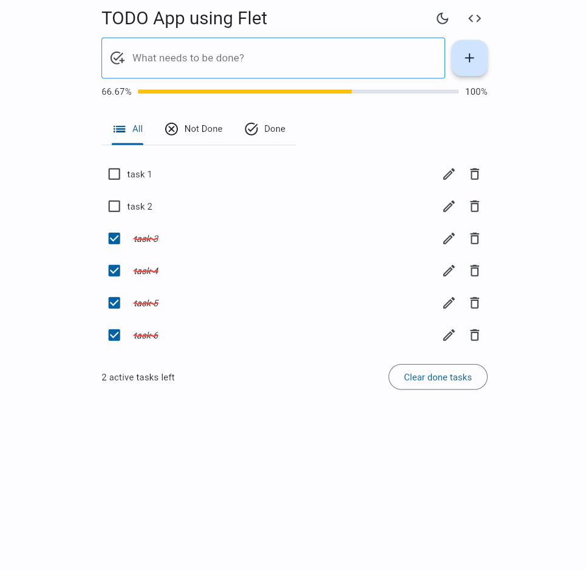
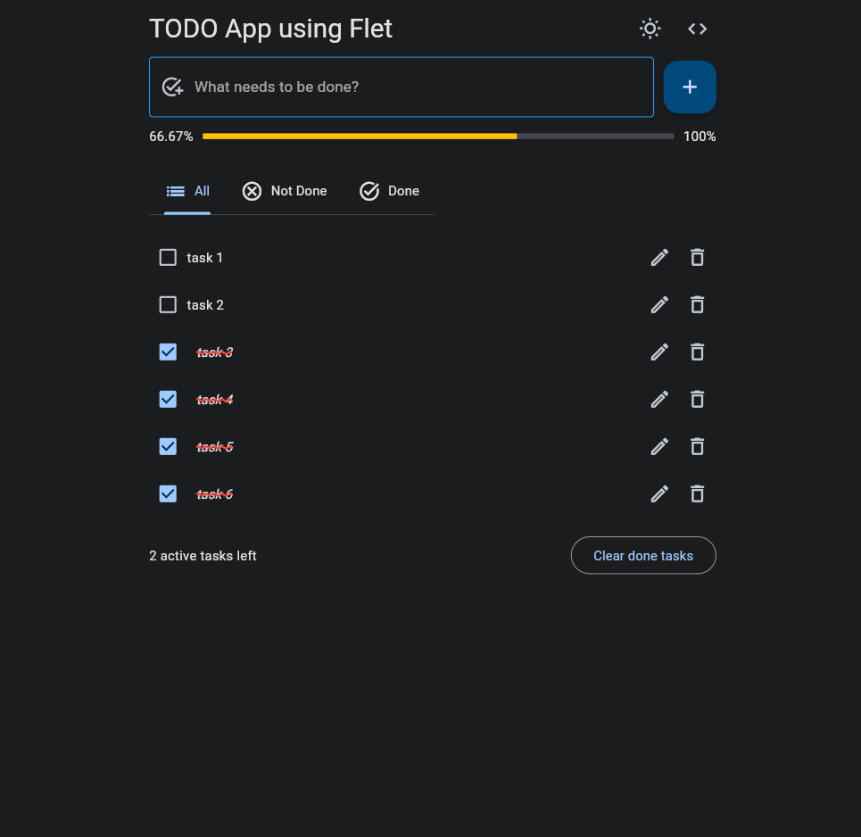

# Simple TODO App using Flet

This is a simple todo application that is made using [Flet](https://flet.dev)

## Previews

|  |  |
|---------------------------------------------|-------------------------------------------|
| Light Mode                                  | Dark Mode                                 |

## Features

- [x] Create, Edit and Delete tasks
- [x] Delete completed tasks
- [x] Track current progress in percentage
- [x] Supports light mode and dark mode
- [x] Persists tasks locally
- [x] Filter tasks by status

## Building

Install `flet` 

```bash
pip install flet
```

Run in hot-reload mode (does not work in web)

```bash
flet run main.py -r
```

To run in android, see the docs [here](https://flet.dev/docs/guides/python/testing-on-android)

To run in ios, see the docs [here](https://flet.dev/docs/guides/python/testing-on-ios)

## Packaging as a desktop app

Install `pyinstaller` dependency

```bash
pip install pyinstaller
```

Then run

```bash
flet pack main.py
```

The bundled flet app would be in the generated `dist` folder.

For more information regarding this, visit the docs [here](https://flet.dev/docs/guides/python/packaging-desktop-app).